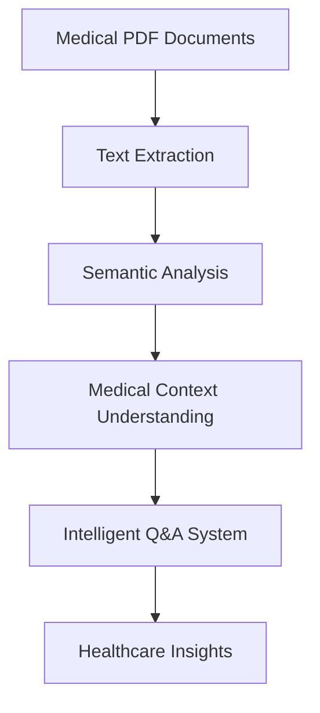

# PDF Question Answering System
## Applications in Diabetes & Cancer Research

---

## 1. Project Overview 🏥

### Medical Data Assistant
- Intelligent analysis of medical documents
- Rapid information retrieval
- Evidence-based answers
- Support for healthcare professionals

---

## 2. Medical Use Cases 🔬

### A. Diabetes Management
1. Patient Records Analysis
2. Treatment Protocol Queries
3. Research Paper Analysis
4. Clinical Trial Data Processing

### B. Cancer Research
1. Pathology Report Analysis
2. Clinical Study Interpretation
3. Treatment Response Data
4. Research Literature Review

---

## 3. Technical Architecture 🏗️

### System Components


---

## 4. Document Processing for Medical Data 📄

### Capabilities:
1. **Medical Document Types**
   - Clinical Reports
   - Lab Results
   - Research Papers
   - Treatment Guidelines
   - Patient Records

2. **Processing Features**
   - Medical terminology recognition
   - Data structure preservation
   - PHI (Protected Health Information) awareness

---

## 5. Medical Data Security 🔒

### Implementation:
1. **Data Protection**
   - Local processing
   - No data storage
   - HIPAA considerations

2. **Privacy Features**
   - Anonymization support
   - Secure file handling
   - Access control

---

## 6. Diabetes Data Applications 🩺

### A. Clinical Support
1. **Treatment Analysis**
   - Medication protocols
   - Dosage guidelines
   - Contraindications

2. **Patient Management**
   - Treatment histories
   - Outcome tracking
   - Compliance monitoring

### B. Research Support
1. **Literature Analysis**
   - Clinical trials
   - Treatment efficacy
   - New research findings

---

## 7. Cancer Research Benefits 🔬

### A. Pathology Support
1. **Report Analysis**
   - Diagnosis patterns
   - Treatment responses
   - Prognostic factors

2. **Research Integration**
   - Clinical trials
   - Treatment protocols
   - Outcome studies

### B. Clinical Applications
1. **Treatment Planning**
   - Protocol selection
   - Case comparisons
   - Evidence-based decisions

---

## 8. Medical Data Processing Features 🧬

### A. Specialized Handling
1. **Medical Terminology**
   - Disease classifications
   - Treatment protocols
   - Drug interactions

2. **Data Structuring**
   - Lab results
   - Clinical observations
   - Treatment outcomes

---

## 9. Question Types for Medical Data 💭

### A. Diabetes Queries
```python
Example Questions:
1. "What are the HbA1c trends for Type 2 patients?"
2. "Summarize treatment outcomes for insulin therapy"
3. "List complications in poorly controlled cases"
```

### B. Cancer Queries
```python
Example Questions:
1. "What are survival rates for Stage 3 treatments?"
2. "Compare effectiveness of chemotherapy protocols"
3. "Analyze tumor response patterns"
```

---

## 10. Benefits for Healthcare Professionals 👨‍⚕️

### A. Time Efficiency
1. **Rapid Information Access**
   - Instant document search
   - Quick answer generation
   - Efficient data review

2. **Decision Support**
   - Evidence-based insights
   - Protocol verification
   - Treatment comparisons

---

## 11. Research Benefits 📚

### A. Literature Analysis
1. **Systematic Reviews**
   - Automated paper analysis
   - Data extraction
   - Pattern identification

2. **Data Synthesis**
   - Cross-study comparison
   - Outcome analysis
   - Trend identification

---

## 12. Clinical Trial Applications 🔍

### A. Trial Data Processing
1. **Participant Data**
   - Inclusion criteria
   - Outcome measures
   - Adverse events

2. **Results Analysis**
   - Efficacy metrics
   - Safety profiles
   - Statistical significance

---

## 13. Treatment Outcome Analysis 📊

### A. Diabetes Metrics
1. **Key Indicators**
   - Blood glucose control
   - Complication rates
   - Treatment adherence

2. **Outcome Measures**
   - Quality of life
   - Cost effectiveness
   - Long-term prognosis

### B. Cancer Metrics
1. **Response Measures**
   - Tumor reduction
   - Survival rates
   - Side effect profiles

---

## 14. Implementation Examples 💻

### A. Diabetes Case Study
```python
Question: "What are the correlations between HbA1c 
          levels and cardiovascular complications?"

System Response:
- Analyzes multiple patient records
- Identifies statistical patterns
- Presents evidence-based insights
```

### B. Cancer Case Study
```python
Question: "Compare survival rates between 
          chemotherapy protocols A and B"

System Response:
- Extracts relevant trial data
- Performs statistical comparison
- Presents survival curves
```

---

## 15. Real-World Applications 🌍

### A. Clinical Practice
1. **Patient Care**
   - Treatment planning
   - Progress monitoring
   - Outcome prediction

2. **Resource Optimization**
   - Protocol selection
   - Cost management
   - Time efficiency

---

## 16. Integration Benefits 🔄

### A. Healthcare Systems
1. **EMR Integration**
   - Record analysis
   - Data extraction
   - Report generation

2. **Research Platforms**
   - Literature review
   - Data synthesis
   - Knowledge management

---

## 17. Future Medical Applications 🚀

### Planned Enhancements
1. **AI-Driven Features**
   - Predictive analytics
   - Risk assessment
   - Treatment optimization

2. **Advanced Analysis**
   - Multi-modal data integration
   - Real-time monitoring
   - Personalized medicine support

---

## 18. Impact on Healthcare 🏥

### Key Benefits
1. **Patient Care**
   - Better treatment decisions
   - Faster diagnoses
   - Improved outcomes

2. **Research Progress**
   - Accelerated discoveries
   - Enhanced collaboration
   - Evidence-based practices

---

## Thank You! 👋

### Contact & Support
For Medical Implementation:
- Clinical support team
- Research collaboration
- Technical assistance
- Training resources

