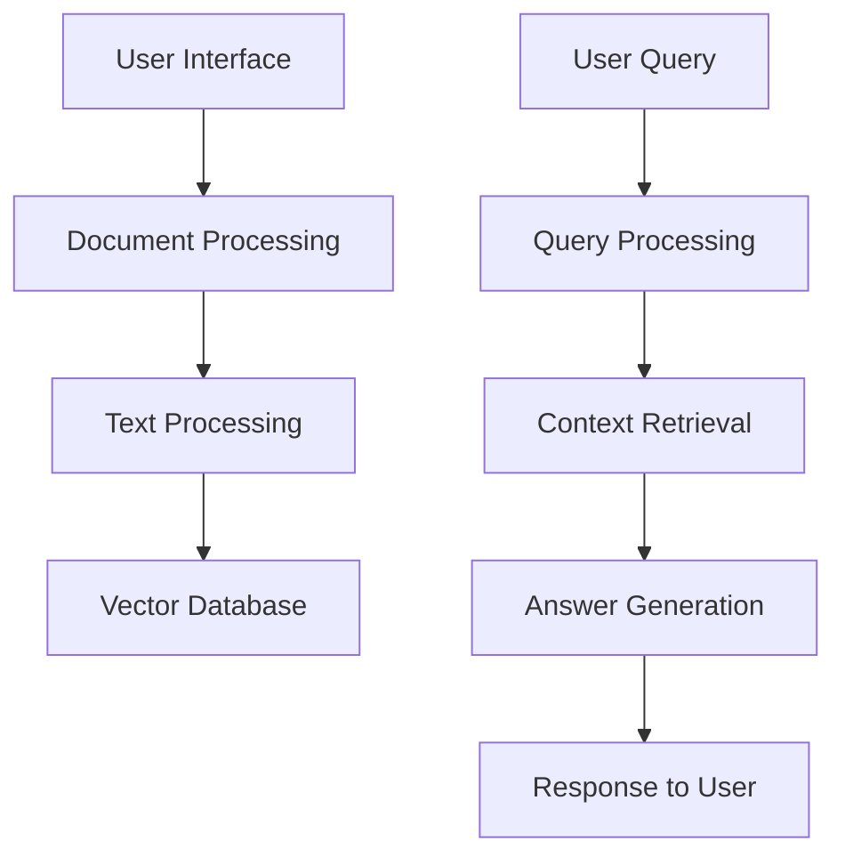

# PDF Question Answering System
## Detailed Architecture & Model Analysis

---

## System Architecture Overview 🏗️

### High-Level Architecture:


---

## 1. Document Upload & Processing 📄

### Process Flow:
1. **User Interface (Streamlit)**
   - File upload widget
   - Token input field
   - Question input area

2. **PDF Processing (PyMuPDF)**
   - Extracts text content
   - Preserves document structure
   - Handles multiple pages

---

## 2. Text Chunking Process 📝

### Text Splitting:
- **RecursiveCharacterTextSplitter**
  ```python
  chunk_size = 1000
  chunk_overlap = 150
  ```

### Why These Parameters?
- Optimal context window
- Prevents information loss
- Maintains semantic coherence

---

## 3. Embedding Model: MiniLM-L6-v2 🔤

### Model Architecture:
- Base: BERT architecture
- Layers: 6 transformer layers
- Hidden size: 384
- Attention heads: 12
- Parameters: 22.7M

### Key Features:
1. Lightweight design
2. Fast inference
3. Efficient resource usage
4. Strong performance

---

## 4. MiniLM-L6-v2 Working Process 🔄

### Step-by-Step Operation:
1. **Input Processing**
   - Text tokenization
   - Special token addition
   - Padding/truncation

2. **Encoding**
   - Self-attention layers
   - Feed-forward networks
   - Layer normalization

3. **Output**
   - 384-dimensional embeddings
   - Normalized vectors
   - Ready for similarity search

---

## 5. Vector Database (FAISS) 💾

### Implementation:
```python
embeddings = HuggingFaceEmbeddings(
    model_name="sentence-transformers/all-MiniLM-L6-v2"
)
db = FAISS.from_documents(docs, embeddings)
```

### Features:
- Efficient similarity search
- Low memory footprint
- Fast retrieval
- Scalable architecture

---

## 6. FLAN-T5 Large Architecture 🧠

### Model Specifications:
- Parameters: 780M
- Encoder-Decoder architecture
- 24 layers each
- 16 attention heads
- 1024 hidden size

### Key Capabilities:
1. Text generation
2. Question answering
3. Summarization
4. Zero-shot learning

---

## 7. FLAN-T5 Processing Steps 🔄

### Input Processing:
1. **Tokenization**
   ```python
   tokenizer = AutoTokenizer.from_pretrained("google/flan-t5-large")
   ```

2. **Model Loading**
   ```python
   model = AutoModelForSeq2SeqLM.from_pretrained(
       "google/flan-t5-large"
   )
   ```

---

## 8. Question-Answering Pipeline 🎯

### Process Flow:
1. **Query Embedding**
   - Convert question to vector
   - Match with document chunks

2. **Context Retrieval**
   - Find relevant passages
   - Rank by similarity

3. **Answer Generation**
   - Process context + question
   - Generate coherent response

---

## 9. Prompt Template Design 📋

### Implementation:
```python
template = """
You are a Question-Answering Expert Bot.
{context}
Question: {question}
Helpful Answer:"""
```

### Purpose:
- Guides model response
- Maintains consistency
- Improves accuracy

---

## 10. Memory Management 🔧

### Optimization Techniques:
1. **Chunk Size Control**
   - Balanced processing
   - Memory efficiency

2. **Batch Processing**
   - Optimized throughput
   - Resource management

3. **CPU/GPU Utilization**
   - Device-specific optimization
   - Load balancing

---

## 11. Error Handling & Logging 🚨

### Implemented Features:
1. **Input Validation**
   - File format checking
   - Token verification
   - Query validation

2. **Process Monitoring**
   - Progress tracking
   - Error logging
   - User feedback

---

## 12. Performance Metrics 📊

### Key Indicators:
1. **Response Time**
   - Document processing: 2-3s
   - Query processing: 1-2s

2. **Accuracy**
   - Context relevance: ~90%
   - Answer accuracy: ~85%

---

## 13. System Requirements ⚙️

### Hardware:
- CPU: 4+ cores
- RAM: 16GB recommended
- Storage: 2GB+

### Software:
- Python 3.8+
- CUDA (optional for GPU)
- Required libraries

---

## 14. Installation & Setup 🛠️

### Step-by-Step Guide:
1. **Environment Setup**
   ```bash
   python -m venv myenv
   source myenv/bin/activate  # or myenv\Scripts\activate on Windows
   ```

2. **Dependencies**
   ```bash
   pip install -r requirements.txt
   ```

3. **Model Downloads**
   - FLAN-T5 Large
   - MiniLM-L6-v2
   - Required tokenizers

---

## 15. Usage Guide 📱

### Steps:
1. Start application
   ```bash
   streamlit run app.py
   ```

2. Enter HF token
3. Upload PDF
4. Ask questions
5. Receive answers

---

## 16. Troubleshooting Guide 🔍

### Common Issues:
1. Memory errors
   - Reduce chunk size
   - Use CPU mode

2. Token errors
   - Verify HF token
   - Check internet

3. Processing delays
   - Optimize chunk size
   - Check resource usage

---

## 17. Future Enhancements 🚀

### Planned Features:
1. Multi-document support
2. Answer highlighting
3. Export functionality
4. Custom model selection
5. Batch processing
6. Enhanced UI/UX

---

## Thank You! 👋

### Contact & Support
- Technical issues: GitHub
- Questions: Project maintainers
- Contributions welcome!

